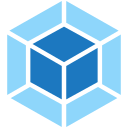
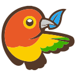
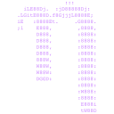

# 👋 Hi there, I'm Cat 🐈

I'm a Senior React Native and React Engineer, as well as an Engineering Leader, with a passion for developing scalable and robust applications. My expertise in leading cross-functional teams has enabled me to turn complex challenges into seamless, user-friendly solutions, making a significant impact in the tech for good and sustainability sectors.

- 🔭 I’m currently working on enhancing mobile and web solutions for the tech for good and sustainability sectors, with a special focus on [🌱 Plantopia Farm](https://plantopia.farm), a project I'm incredibly proud of for its potential to revolutionize urban agriculture.
- 🌱 I’m constantly learning and staying updated with the latest in React, React Native, Node.js, and NextJS.
- 👯 I’m looking to collaborate on innovative projects that make a difference.
- 🤔 I’m looking for help with exploring advanced architectural patterns.
- 💬 Ask me about anything related to React/React Native development, project management, or team leadership.
- 📫 How to reach me: <cat@catcodes.com>
- 😄 Pronouns: He/Him
- ⚡ Fun fact: When I'm not coding, I'm probably DIY-ing something around the house or exploring urban agriculture innovations.

## Connect with me

<p align="left">
  <a href="https://catapps.co.uk" target="_blank" rel="noreferrer">
    &nbsp;
  </a>
  <a href="https://linkedin.com/company/catapps" target="_blank" rel="noreferrer">
    
  </a>
  <a href="https://www.facebook.com/catapps.co.uk" target="_blank" rel="noreferrer">
    
  </a>
  <a href="https://www.github.com/cat-apps" target="_blank" rel="noreferrer">
    
  </a>
  <a href="http://www.instagram.com/cat-apps" target="_blank" rel="noreferrer">
    
  </a>
  <a href="https://www.x.com/catapps" target="_blank" rel="noreferrer">
    
  </a>&nbsp;&nbsp;&nbsp;&nbsp;&nbsp;&nbsp;&nbsp;&nbsp;&nbsp;&nbsp;&nbsp;&nbsp;&nbsp;&nbsp;&nbsp;&nbsp;&nbsp;&nbsp;&nbsp;&nbsp;
  <a href="https://iamcat.co.uk" target="_blank" rel="noreferrer">
    
  </a>
  <a href="https://www.linkedin.com/in/catalin-magirescu" target="_blank" rel="noreferrer">
    
  </a>&nbsp;&nbsp;&nbsp;&nbsp;&nbsp;&nbsp;&nbsp;&nbsp;&nbsp;&nbsp;&nbsp;&nbsp;&nbsp;&nbsp;&nbsp;&nbsp;&nbsp;&nbsp;&nbsp;&nbsp;
  <a href="https://mentorcruise.com/mentor/catalinmagirescu/" target="_blank" rel="noreferrer">
    
  </a>
  <!-- <a href="https://mentorcruise.com/mentor/catalinmagirescu/" target="_blank" rel="noreferrer">
    
  </a> -->
  </br></br>

## :octocat: My GitHub Stats

<div align="center">
  
  
  
  
</div>

<!--START_SECTION:waka-->

```txt
Total Time: 776 hrs 13 mins

Other                      441 hrs 9 mins  ⣿⣿⣿⣿⣿⣿⣿⣿⣿⣿⣿⣿⣿⣿⣄⣀⣀⣀⣀⣀⣀⣀⣀⣀⣀   56.83 %
TypeScript                 256 hrs 47 mins ⣿⣿⣿⣿⣿⣿⣿⣿⣤⣀⣀⣀⣀⣀⣀⣀⣀⣀⣀⣀⣀⣀⣀⣀⣀   33.08 %
Less                       25 hrs 34 mins  ⣷⣀⣀⣀⣀⣀⣀⣀⣀⣀⣀⣀⣀⣀⣀⣀⣀⣀⣀⣀⣀⣀⣀⣀⣀   03.30 %
JavaScript                 18 hrs 30 mins  ⣶⣀⣀⣀⣀⣀⣀⣀⣀⣀⣀⣀⣀⣀⣀⣀⣀⣀⣀⣀⣀⣀⣀⣀⣀   02.39 %
JSON                       18 hrs 29 mins  ⣶⣀⣀⣀⣀⣀⣀⣀⣀⣀⣀⣀⣀⣀⣀⣀⣀⣀⣀⣀⣀⣀⣀⣀⣀   02.38 %
```

<!--END_SECTION:waka-->

## 🛠️ Languages and Tools

<div align="center">
  <p><strong>Core Web and Scripting Technologies</strong></p></br>
  &nbsp;
  &nbsp;
  &nbsp;
  &nbsp;
  &nbsp;
  &nbsp;
  &nbsp;
  &nbsp;
  &nbsp;
  &nbsp;
  &nbsp;
  &nbsp;
  &nbsp;
  &nbsp;
  &nbsp;
  &nbsp;
  &nbsp;
  &nbsp;
  &nbsp;
  &nbsp;
  &nbsp;
  &nbsp;
  &nbsp;
  &nbsp;
  
  </br></br>
  <p><strong>Backend, Database, and API Technologies</strong></p></br>
  &nbsp;
  &nbsp;
  
  
  &nbsp;
  &nbsp;
  &nbsp;
  &nbsp;
  
  
  &nbsp;
  &nbsp;
  &nbsp;
  &nbsp;
  &nbsp;
  
  
  </br></br>
  <p><strong>DevOps, Cloud, and Infrastructure</strong></p></br>
  &nbsp;
  &nbsp;
  &nbsp;
  &nbsp;
  &nbsp;
  &nbsp;
  &nbsp;
  &nbsp;
  &nbsp;
  &nbsp;
  &nbsp;
  &nbsp;
  </br></br>
  <details>
    <summary>More Tools and Technologies</summary>
    </br>
    <p><strong>CI/CD, Testing, and Version Control</strong></p></br>
    &nbsp;
    &nbsp;
    &nbsp;
    &nbsp;
    &nbsp;
    &nbsp;
    &nbsp;
    &nbsp;
    &nbsp;
    &nbsp;
    &nbsp;
    &nbsp;
    &nbsp;
    &nbsp;
    &nbsp;
    
    </br></br>
    <p><strong>Real-time, Security, and Performance Monitoring</strong></p></br>
    &nbsp;
    &nbsp;
    &nbsp;
    &nbsp;
    &nbsp;
    
    </br></br>
    <p><strong>Frontend Build Tools and Static Site Generators</strong></p></br>
    &nbsp;
    &nbsp;
    &nbsp;
    &nbsp;
    &nbsp;
    &nbsp;
    &nbsp;
    &nbsp;
    &nbsp;
    
    </br></br>
    <p><strong>And some more tools</strong></p></br>
    &nbsp;
    &nbsp;
    &nbsp;
    &nbsp;
    &nbsp;
    &nbsp;
    &nbsp;
    &nbsp;
    &nbsp;
    &nbsp; 
    &nbsp;
    &nbsp;
    &nbsp;
    &nbsp;
    &nbsp;
    &nbsp;
    &nbsp;
    &nbsp;
    &nbsp;
    &nbsp;
    &nbsp;
    &nbsp;
    &nbsp;
    &nbsp;
    &nbsp;
    &nbsp;
    &nbsp; 
    &nbsp;
  </details>
</div></br></br>

## ⚙️ What I'm working on

I'm deeply committed to creating scalable solutions for the tech for good and sustainability sectors, with [🌱 Plantopia Farm](https://plantopia.farm) being a cornerstone project in my portfolio. This initiative is not just a project; it's a testament to how technology can be harnessed to make significant strides in sustainable living and urban agriculture. My work with [😻 Cat Apps](https://catapps.co.uk) [:octocat:](https://github.com/Cat-Apps) is aimed at leveraging cutting-edge technology to revolutionize various sectors, integrating advanced technology with everyday needs, and making a tangible difference in the world.

&nbsp;

## 👀 Looking forward

I'm always on the lookout for new challenges and opportunities to grow. My journey is about more than just developing new software solutions; it's about leading teams to success, contributing to the tech community, and making a lasting impact through innovation and strategic execution.

---

Thanks for stopping by! Feel free to reach out if you have any questions or just want to connect.

## 😹 Enjoy joke of the day

<p align="center">
  
</p>

<p align="center">
  You're not just another visitor, you're the special one with this unique profile view number: </br>
  
</p>
